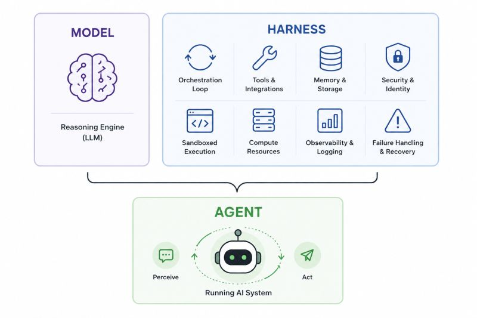

# Understanding Agent Harnesses

## Why Agents?

Models are stateless. They process one request, produce a completion, and forget. They can't take action, access live data, or coordinate multi-step workflows alone. Agents solve this by wrapping a model in a runtime system that gives it tools, memory, and a reasoning loop.

## The Agent Loop




1. Model receives **context** (system prompt + user input + tool list + history)
2. Model **reasons** and decides whether to call a tool
3. Tool **executes**, result feeds back into context
4. Loop **repeats** until the task is complete

## Agent = Model + Harness


The **harness** is the system that surrounds the model and turns it into an agent. It handles the agent loop, tool execution, context management, memory, lifecycle control, observability, and verification.

Together, **model + harness = agent.**

## Three Layers of Engineering

**Prompt Engineering:** Instructions and constraints sent to the model

**Context Engineering:** What information enters the context window, when, and how

**Harness Engineering:** The runtime system orchestrating everything

## Strands Agents SDK

[Strands Agents](https://strandsagents.com/) is an open-source SDK for building agent harnesses. It provides composable primitives like tools, context management, lifecycle hooks, memory, sessions, evals, observability that you assemble into whatever system your use case requires.

**Design philosophy:** Let the model drive. You define the environment and boundaries; the model reasons through the task.

📖 [Getting Started Guide](https://strandsagents.com/latest/user-guide/getting-started/) · [Tools Docs](https://strandsagents.com/latest/user-guide/concepts/tools/tools-overview/) · [Full Documentation](https://strandsagents.com/latest/)

## Code: A Simple Agent

This is already a working agent with a loop without tools.

```python
from strands import Agent

agent = Agent()

response = agent("What are the key differences between REST and GraphQL APIs?")
print(response)

```

📂 [simple_agent.py](https://github.com/aws-samples/sample-building-with-strands-course/tree/main/samples/01-agent-loop/simple_agent.py) — Find all code examples in GitHub

## Code: Agent with Tools

```python
import json
from strands import Agent, tool
from strands_tools import http_request, file_write

@tool
def query_product_database(query: str) -> str:
    """Query the internal product database for inventory and pricing information.

    Args:
        query: Search query for products (e.g., "wireless headphones", "USB-C hub")
    """
    products = {
        "wireless headphones": "SKU-WH100: Wireless Headphones Pro — $79.99, 142 in stock, 4.5★ rating, launched 2025-03",
        "usb-c hub": "SKU-UC200: USB-C Hub 7-in-1 — $45.00, 89 in stock, 4.2★ rating, launched 2024-11",
        "mechanical keyboard": "SKU-MK300: Mechanical Keyboard RGB — $149.99, 23 in stock, 4.8★ rating, launched 2025-01",
        "noise cancelling": "SKU-NC400: Noise Cancelling Earbuds — $129.99, 67 in stock, 4.6★ rating, launched 2025-05",
    }
    key = query.lower()
    matches = [info for product_key, info in products.items() if product_key in key]
    if matches:
        return "\n".join(matches)
    return f"No products found matching '{query}'. Available: wireless headphones, usb-c hub, mechanical keyboard, noise cancelling"

SYSTEM_PROMPT = """You are a product research analyst. You help the team understand
market positioning by comparing competitor pricing with our internal catalog.

When given a research task:
1. Use http_request to gather public market data
2. Use query_product_database to check our internal pricing and inventory
3. Write a brief competitive analysis and save it using file_write"""

agent = Agent(
    tools=[http_request, file_write, query_product_database],
    system_prompt=SYSTEM_PROMPT,
)

result = agent("Research what wireless headphones are trending on the market and compare it against our offerings. "
               "Write a short competitive positioning summary and save it to report.md")

```

Key concepts:

- **@tool decorator** — turns any Python function into an agent-callable tool
- **Docstrings** become the tool description the model sees
- **Type hints** auto-generate the input schema
- **System prompt** defines agent identity and behavior

📂 [agent_with_tools.py](https://github.com/aws-samples/sample-building-with-strands-course/tree/main/samples/01-agent-loop/agent_with_tools.py) — Find all code examples in GitHub

## Out of the Box Agents

Strands also ships preconfigured defaults that give you a capable agent out of the box:

- **Built-in tools** — file operations, shell, search, web access
- **Automatic context management** — proactive compression when the window fills
- **Sub-agent delegation** — spawn child agents for subtasks

You can start with these defaults and customize from there, or build from scratch using the primitives.

```python
from strands import Agent
from strands.models import BedrockModel
from strands.agent.conversation_manager import SummarizingConversationManager
from strands.vended_plugins.context_offloader import ContextOffloader, FileStorage
from strands_tools import file_read, file_write, editor, shell, http_request, use_agent

agent = Agent(
    model=BedrockModel(
        model_id="us.anthropic.claude-sonnet-4-20250514-v1:0",
    ),
    # Built-in tools for file ops, shell, web, and subagent delegation
    tools=[file_read, file_write, editor, shell, http_request, use_agent],
    # Proactive compression — summarizes context before hitting the limit
    conversation_manager=SummarizingConversationManager(
        proactive_compression={"compression_threshold": 0.9},
    ),
    # Offloads large tool results externally, keeps a preview in context
    plugins=[
        ContextOffloader(
            storage=FileStorage("./offloaded"),
            max_result_tokens=8_000,
            preview_tokens=2_000,
        ),
    ],
)

# Give it a research task
agent("Research the current state of AI agent deployment patterns in production, including common architectures, challenges teams face, and best practices. Write a summary to report.md")

```

📂 [agent_with_defaults.py](https://github.com/aws-samples/sample-building-with-strands-course/tree/main/samples/01-agent-loop/agent_with_defaults.py) — Find all code examples in GitHub

## Resources

- 📖 [Getting Started](https://strandsagents.com/docs/user-guide/quickstart/python/)
- 📖 [Strands Agents MCP Server](https://strandsagents.com/docs/user-guide/build-with-ai/)
- 📖 [Tools](https://strandsagents.com/docs/user-guide/concepts/tools/)
- 📖 [Custom Tools](https://strandsagents.com/docs/user-guide/concepts/tools/custom-tools/)

