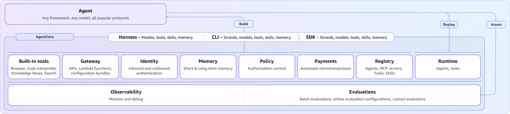

# Deploying to Production with AgentCore

You can containerize a Strands agent and run it anywhere. You just learned how to deploy to AWS using Amazon Bedrock AgentCore Runtime (isolated microVMs), Memory (persistent + long-term), and Observability (automatic tracing).




## Making Your Agent Deployable

Add `BedrockAgentCoreApp` and an entrypoint:

```python
from strands import Agent
from strands.agent.conversation_manager import SlidingWindowConversationManager
from bedrock_agentcore.runtime import BedrockAgentCoreApp
from bedrock_agentcore.memory.integrations.strands.config import (
    AgentCoreMemoryConfig, RetrievalConfig
)
from bedrock_agentcore.memory.integrations.strands.session_manager import (
    AgentCoreMemorySessionManager
)

app = BedrockAgentCoreApp()

MEMORY_ID = os.environ.get("BEDROCK_AGENTCORE_MEMORY_ID", "")

def create_agent(actor_id: str, session_id: str):
    # AgentCore Memory for persistence + long-term recall
    session_manager = None
    if MEMORY_ID:
        config = AgentCoreMemoryConfig(
            memory_id=MEMORY_ID,
            session_id=session_id,
            actor_id=actor_id,
            retrieval_config={
                "/users/{actorId}/facts": RetrievalConfig(),
                "/users/{actorId}/preferences": RetrievalConfig(),
            },
        )
        session_manager = AgentCoreMemorySessionManager(
            agentcore_memory_config=config,
            region_name="us-east-1",
        )

    return Agent(
        tools=[lookup_customer, get_order_history, process_refund],
        plugins=[AgentSkills(skills=["./skills"]), RefundWorkflowHandler(), tone_handler],
        system_prompt=SYSTEM_PROMPT,
        conversation_manager=SlidingWindowConversationManager(window_size=20),
        session_manager=session_manager,
    )

```

📂 [main.py](https://github.com/aws-samples/sample-building-with-strands-course/tree/main/samples/14-deploy/main.py) — Find all code on GitHub

## Deployment Commands

```bash
# Install CLI
npm install -g @aws/agentcore

# Scaffold project
agentcore create

# Add memory
agentcore add memory --name CustomerServiceMemory --strategies SEMANTIC,USER_PREFERENCE

# Deploy
agentcore deploy

# Invoke
SESSION_ID="<SESSION ID HERE>"
agentcore invoke --session-id "$SESSION_ID" \
  '{"prompt": "I need help returning my order", "actor_id": "sarah"}'

```

## What AgentCore Provides

| Component | What It Does |
| --- | --- |
| **Runtime** | Isolated microVMs, maintains state across requests |
| **Memory** | Conversation persistence + semantic long-term recall |
| **Observability** | Automatic traces, logs, execution telemetry |
| **Gateway** | Expose APIs as MCP-compatible tools |
| **Identity** | IAM or OAuth authentication gate |

AgentCore has other capabilities as well, you can read more about them [here](https://docs.aws.amazon.com/bedrock-agentcore/latest/devguide/what-is-bedrock-agentcore.html).

## What You Still Need

The deployed agent is only part of production architecture. You still need: API gateways, rate limiting, retries, security controls, monitoring, and error handling around it. Read [this blog](https://dev.to/aws/we-need-to-talk-about-ai-agent-architectures-4n49) to learn about why AI agent architectures matter.

## Resources

- 📖 [Amazon Bedrock AgentCore Developer Guide](https://docs.aws.amazon.com/bedrock-agentcore/latest/devguide/what-is-bedrock-agentcore.html)
- 📖 [AgentCore Runtime docs](https://docs.aws.amazon.com/bedrock-agentcore/latest/devguide/runtime.html)
- 📖 [AgentCore Memory docs](https://docs.aws.amazon.com/bedrock-agentcore/latest/devguide/memory.html)
- 📖 [AgentCore Observability docs](https://docs.aws.amazon.com/bedrock-agentcore/latest/devguide/observability.html)
- 📖 [AgentCore CLI Reference](https://docs.aws.amazon.com/bedrock-agentcore/latest/devguide/cli-reference.html)
- 📖 [Strands Agents — Deployment Guide](https://strandsagents.com/latest/user-guide/deploy/)
- 📖 [Blog: "What Is an Agent Harness?"](https://dev.to/aws/what-is-an-agent-harness-a-hands-on-guide-with-agentcore-harness-1h33)
- 📖 [Blog: "We Need to Talk About AI Agent Architectures"](https://dev.to/aws/we-need-to-talk-about-ai-agent-architectures-4n49)

